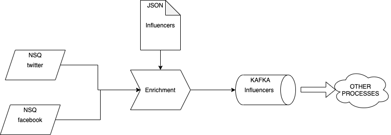

# Take Home Programming Task
The goal of this task is to test your knowledge of the fundamentals of development and the processes involved.
The topics that we will be reviewing are:

- The design of the solution provided
- The code quality
- The unit testing
- Adherence to the requirements

# Preamble
Our team is ingesting data via NSQ(https://nsq.io/) in different topics depending on the source. Each source has its own
data model and we want to store the data using a common model which unifies the naming of the attributes. Once the data is transformed 
following the common model it will be added to a Kafka queue in a JSON format. This message will have a different action (index or update) 
depending of the data we already have in ElasticSearch (***in this case we just need to read an [attached file](data/influencers) with some Elasticsearch documents***)

# Exercise
Create an enrichment service which reads messages from NSQ topics (twitter, facebook) and generates messages in a Kafka topic (influencers) 
**based on the data we already have stored**.

The enrichment process will create an:
 - index kafka message when we don't have the influencer in our DB (in this case our [JSON file](data/influencers))
 - update kafka message when we have the profile in our DB but the updated_at is before to the ingested one.
 - update kafka message when the ingested message match a name from other social network of an influencer that already exists in the DB (to add the missing social network to the profile).
 - delete kafka message when the ingested message has a deleted_at and it is the only social profile we have in our DB (otherwise just create an update with empty profile [see example](https://github.com/beholderCision/influencer-home-exercise#example---update-kafka-message-deleting-social-profile-nsq-message-with-deleted_at)
    - **Discard any new message creating that social profile**

**The enrichment process will discard any message without the required attributes (id, name, updated_at)**

### Twitter message model
|Key|Type|Description|
|---|---|---|
|id|int|inmutable|
|screen_name|string|mutable|
|biography|string|mutable|
|profile_image|string|mutable|
|location|string|mutable|
|updated_at|date|mutable|
|deleted_at|date|mutable|

### Facebook message model
|Key|Type|Description|
|---|---|---|
|id|int|inmutable|
|username|string|mutable|
|about|string|mutable|
|image|string|mutable|
|location|string|mutable|
|updated_at|date|mutable|
|deleted_at|date|mutable|

### Influencer model
-|-|-|type|required|
|---|---|---|---|---|
|profiles||
| |twitter|
| | |id|int|yes
| | |name|string|yes
| | |image|string|no
| | |bio|string|no
| | |location|string|no
| | |updated_at|date|yes
| |facebook|
| | |id|int|yes
| | |name|string|yes
| | |image|string|no
| | |bio|string|no
| | |location|string|no
| | |updated_at|date|yes
|updated_at|(added in enrichment)| |date|yes

### Example - Index Kafka message
``{ "index" : {"_index" : "influencers", "_retry_on_conflict" : 3}}`+"\n"``

``{"profiles" : {"facebook": {"id": 20,"name": "infl0","bio": "this is 0","updated_at" : "2021-01-25T21:13:42Z"} },"updated_at" : "2021-02-15T21:13:42Z"}`+"\n"``

### Example - Update Kafka message
``{ "update" : {"_index" : "influencers", "_retry_on_conflict" : 3, "_id" : "0"}}` + "\n"``

``{ "doc": `{"profiles" : {"twitter": {"id": 00,"name": "infl0","bio": "this is 0","updated_at" : "2021-01-25T21:13:42Z"}},"updated_at" : "2021-01-25T21:13:42Z"}`, "doc_as_upsert" : true }` + "\n" ``

### Example - Update Kafka message deleting social profile (NSQ message with deleted_at)
``{ "update" : {"_index" : "influencers", "_retry_on_conflict" : 3, "_id" : "12"}}` + "\n"``

``{ "doc": `{"profiles" : {"facebook": {}},"updated_at" : "2021-01-25T21:13:42Z"}`, "doc_as_upsert" : true }` + "\n" ``

### Example - Delete Kafka message
``{ "delete" : {"_index" : "influencers", "_retry_on_conflict" : 3, "_id" : "0"}}`+ "\n"``

# Prerequisites
 - Have a working Java/GO IDE on your machine
 - Docker desktop (_to run our [docker compose file](docker-compose.yml)_)
 - Kafka tool (to check kafka messages) https://www.kafkatool.com/download.html
  

# This & That
- Searching online for answers is acceptable and encouraged.
- **Share your code in a git repo (Preferable) or a zip file returned to the email address that sent you these requirements.** 
- You are free to use any messaging systems you like or are familiar with. We use these two, but they are not the only ones!
(We provide a [docker compose file](docker-compose.yml) so you can have these queues ready to go, ***NSQ has also some messages ready to ingest. UI - http://localhost:4171***)
- We are testing for general GO/Java knowledge and some critical thought processes around design patterns and exception handling.
- Spend 3 hours coding. If you don't finish - that isn't a deal breaker. If you must spend more than 3 hours - 
just let us know how far you got within the allotted time. 
- Feel free to reach out with any clarifications needed. 
